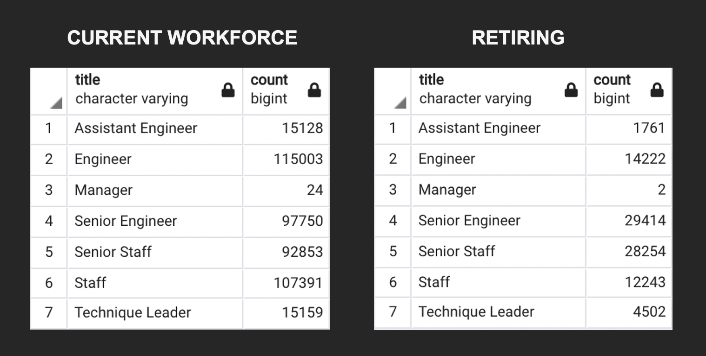

# Pewlett-Hackard-Analysis

## Purpose

As many current employees reach retirement age, we are aiming to determine the number of retiring employees per title, and identify employees who are eligible to participate in a mentorship program. Identifying the roles that require the most attention may ensure a smooth transition implementation for the management.  

## Results

- There are about 90,000 employees retiring. 
- Senior employees, naturally, make up the largest group among those retiring. 
- The ratio of *Senior Engineers and Senior Staff* to *Engineers and Staff* retiring is 2/1
- Only 5% of Senior Engineers retiring are eligible for mentorship, while there is no one eligible for mentorship in all other departments. 

## Summary

Comparing the current workforce per title to retiring employees per title we can calculate the percentage of employees retiring per title. This way we can mark the specific roles that require special attention and careful planning. 

The percentage of retiring Senior Engineers and Senior Staff is almost 30% of the current workforce. In the same category we find Technique Leaders with 4,502 out of 15,159 retiring which amounts to 29,7% . On the other hand, Engineers and Assistant Engineers are retiring at a far more reasonable rate of about 10% of current workforce. Engineers also make up the largest group of all titles. It is evident that the roles of Senior Engineer, Senior Staff, and Technique Leaders are the ones that need to be filled before the retirement wave is in effect. 

